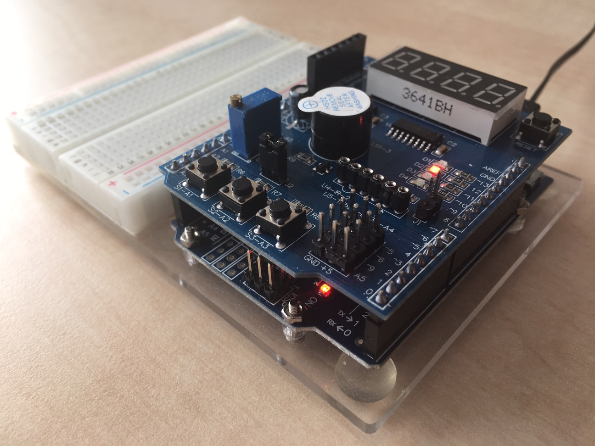

# Lab 4: Interrupts, timers

### Learning objectives

The purpose of the laboratory exercise is to understand the function of the interrupt, interrupt service routine, and the functionality of timer units. Another goal is to practice finding information in the MCU manual; specifically setting timer control registers

## Preparation tasks (done before the lab at home)

Consider an n-bit number that we increment based on the clock signal. If we reach its maximum value and try to increase it, the value will be reset. We call this state an overflow. The overflow time depends on the frequency of the clock signal, the number of bits, and on the prescaler value:

&nbsp;

&nbsp;

Calculate the overflow times for three Timer/Counter modules that contain ATmega328P if CPU clock frequency is 16&nbsp;MHz. Complete the following table for given prescaler values. Note that, Timer/Counter2 is able to set 7 prescaler values, including 32 and 128.

| **Module** | **Number of bits** | **1** | **8** | **32** | **64** | **128** | **256** | **1024** |
| :-: | :-: | :-: | :-: | :-: | :-: | :-: | :-: | :-: |
| Timer/Counter0 | 8  | 16us | 128us | -- | 1.024ms | -- |4.096ms | 16.384ms|
| Timer/Counter1 | 16 | 4.096ms  | 32.768ms    | -- | 262.144ms | -- | 1.048576s| 4.194304s |
| Timer/Counter2 | 8  | 16us | 128us|512us | 1.024ms | 2.048ms  | 4.096ms| 16.384ms|

Connection of four LEDs (D1, D2, D3, D4) and three push buttons (S1-A1, S2-A2, S3-A3) on Multifunction Shield

The LEDs are connected as follow: D1=PB5[13],  D2=PB4[12],  D3=PB3[~11],  D4=PB2[~10],

And the push buttons are connected as follows: S1-A1=PC1[A1],  S2-A2=PC2[A2],  S3-A3=PC3[A3].

The timer modules can be configured with several special purpose registers. According to the [ATmega328P datasheet](https://www.microchip.com/wwwproducts/en/ATmega328p) (eg in the **8-bit Timer/Counter0 with PWM > Register Description** section), which I/O registers and which bits configure the timer operations?

| **Module** | **Operation** | **I/O register(s)** | **Bit(s)** |
| :-: | :-- | :-: | :-- |
| Timer/Counter0 | Prescaler  8-bit data value Overflow interrupt enable | TCCR0B  TCNT0 TIMSK0 | CS02, CS01, CS00 (000: stopped, 001: 1, 010: 64, 100: 256, 101: 1024) TCNT0[7:0] TOIE0(1: enable, 0: disable)|
| Timer/Counter1 | Prescaler  16-bit data value Overflow interrupt enable | TCCR1B  TCNT1H, TCNT1L TIMSK1 | CS12, CS11, CS10 (000: stopped, 001: 1, 010: 8, 011: 64, 100: 256, 101: 1024) TCNT1[15:0] TOIE1 (1: enable, 0: disable) |
| Timer/Counter2 | Prescaler  8-bit data value Overflow interrupt enable | TCCR2B    TCNT2  TIMSK2 | CS22, CS11, CS10   (000: stopped, 001: 1, 010: 8, 011: 32, 100: 64, 101: 128, 110: 256, 111: 1024)  TCNT2[7:0]  TOIE2(1: enable, 0; disable) |

## Source of interruptions

| **Program address** | **Source** | **Vector name** | **Description** |
| :-: | :-- | :-- | :-- |
| 0x0000 | RESET | -- | Reset of the system |
| 0x0002 | INT0  | `INT0_vect`&nbsp; | External interrupt request number 0|
| 0x0004 | INT1 |  `INT1_vect`  | External interrupt request 1 |
| 0x0006 | PCINT0 | `PCINT0_vect` | Pin change interrupt request 0 |
| 0x0008 | PCINT1 | `PCINT1_vect` | Pin change interrupt request 1 |
| 0x00A  | PCINT2 | `PCINT2_vect` | Pin change interrupt request 2 |
| 0x00C  | WDT | `WDT_vect` | Watchdaog Time-out interrupt |
| 0x0012 | TIMER2_OVF | `TIMER2_OVF_vect` | Timer/counter2 Overflow |
| 0x0018 | TIMER1_COMPB | `TIMER1_COMPB_vect` | Compare match between Timer/Counter1 value and channel B compare value |
| 0x001A | TIMER1_OVF | `TIMER1_OVF_vect` | Overflow of Timer/Counter1 value |
| 0x0020 | TIMER0_OVF | `TIMER0_OVF_vect` | Timer/Counter0 Overflow |
| 0x0024 | USART_RX | `USART_vect` | USART_Rx complete |
| 0x002A | ADC | `ADC_vect` | ADC Conversion Complete |
| 0x0030 | TWI | `TWI_vect` | 2-wire Serial interface |

## PWM

| **Module** | **Description** | **MCU pin** | **Arduino pin** |
| :-: | :-: | :-: | :-: |
| Timer/Counter0 | OC0A | PD6 | 6  |
|                | OC0B | PD5 | 5  |
| Timer/Counter1 | OC1A | PB1 | 9  |
|                | OC1B | PB2 | 10 |
| Timer/Counter2 | OC2A | PB3 | 11 |
|                | OC2B | PD3 | 3  |