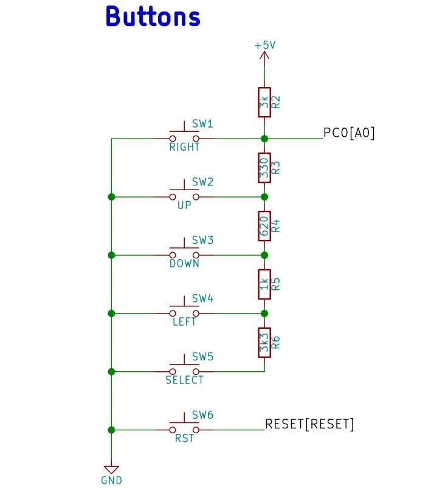
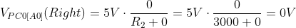
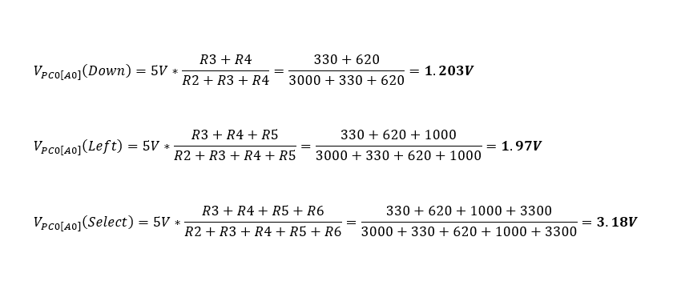
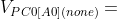
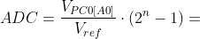

# Lab 7: ADC and UART serial communication

### Learning objectives

The purpose of the laboratory exercise is to understand analog-to-digital number conversion and the use of an internal 8-channel 10-bit AD converter. Another goal is to understand serial asynchronous communication, data frame structure and communication options using an internal USART uni

## Preparation tasks (done before the lab at home)

Use schematic of the [LCD keypad shield](../../Docs/arduino_shield.pdf) and find out the connection of five push buttons: Select, Left, Up, Down, and Right.

&nbsp;
&nbsp;

&nbsp;
&nbsp;

According to the connection, calculate the voltage value on pin PC0[A0] if one button is pressed at a time. In this case, the voltage on the pin is given by the [voltage divider](https://www.allaboutcircuits.com/tools/voltage-divider-calculator/), where resistors R3, R4, R5 and R6 are applied successively.

&nbsp;

&nbsp;

What is the voltage value if none of the push buttons is pressed?

&nbsp;

Calculate the ADC values for these voltages according to the following equation if reference is Vref=5V and number of bits for analog to digital conversion is n=10.

   | **Push button** | **PC0[A0] voltage** | **ADC value (calculated)** | **ADC value (measured)** |
   | :-: | :-: | :-: | :-: |
   | Right  | 0 V     | 0      | 0  |
   | Up     | 0.495 V | 101    | 101 |
   | Down   | 1.202 V |  246   | 245 |
   | Left   |  1.97 V |  403   | 402 |
   | Select |  3.18 V |  650   | 650 |
   | none   |  5 V    |  1023  | 1022 |

&nbsp;

The operation with the AD converter is performed through ADMUX, ADCSRA, ADCL+ADCH, ADCSRB, and DIDR0 registers. See [ATmega328P datasheet](https://www.microchip.com/wwwproducts/en/ATmega328p) (**Analog-to-Digital Converter > Register Description**) and complete the following table.

   | **Operation** | **Register(s)** | **Bit(s)** | **Description** |
   | :-: | :-- | :-- | :-- |
   | Voltage reference | ADMUX | REFS1:0 | 01: AVcc voltage reference, 5V |
   | Input channel |  | MUX3:0 | 0000: ADC0, 0001: ADC1, ... |
   | ADC enable | ADCSRA | ADEN | This bit enables and disables ADC |
   | Start conversion |  | ADSC  | To stat conversion, this bit need to be set to 1  |
   | ADC interrupt enable |  | ADIE | Setting this bit to one enables the ADC conversion complete interrupt |
   | ADC clock prescaler |  | ADPS2:0 | 000: Division factor 2, 001: 2, 010: 4, ...|
   | ADC result | ADCL and ADCH |  |  |

&nbsp;

Selected functions from [UART library](http://www.peterfleury.epizy.com/avr-software.html) developed by Peter Fleury.

   | **Function name** | **Function parameters** | **Description** | **Example** |
   | :-- | :-- | :-- | :-- |
   | `uart_init` | `UART_BAUD_SELECT(9600, F_CPU)` | Initialize UART to 8N1 and set baudrate to 9600&nbsp;Bd | `uart_init(UART_BAUD_SELECT(9600, F_CPU));` |
   | `uart_getc` | `void` | get received data from ringbuffer  |`uart_getc(0);` |
   | `uart_putc` | `unsigned char data` | Put byte to ringbuffer for transmitting via UART | `uart_putc('x');`|
   | `uart_puts` | `const char* s` | Put string to ringbuffer for transmitting via UART | `uart_puts("DE2");`|
