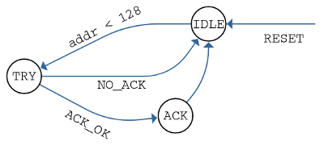

# Lab 8: I2C/TWI serial communication

### Learning objectives

The purpose of the laboratory exercise is to understand XXX

## Preparation tasks (done before the lab at home)

Use schematic of the [Arduino Uno](../../Docs/arduino_shield.pdf) board and find out to which pins the SDA and SCL signals are connected.

   | **Signal** | **MCU pin** | **Arduino pin(s)** |
   | :-: | :-: | :-: |
   | SDA (data)  | PC4  | SDA |
   | SCL (clock) | PC5 | SCL |

What is the general structure of I2C address and data frames?

   | **Frame type** | **8** | **7** | **6** | **5** | **4** | **3** | **2** | **1** | **0** | **Description**&nbsp;&nbsp;&nbsp;&nbsp;&nbsp;&nbsp;&nbsp;&nbsp;&nbsp;&nbsp;&nbsp;&nbsp;&nbsp;&nbsp;&nbsp;&nbsp;&nbsp;&nbsp;&nbsp;&nbsp;&nbsp;&nbsp;&nbsp;&nbsp;&nbsp;&nbsp;&nbsp;&nbsp;&nbsp;&nbsp;&nbsp;&nbsp;&nbsp;&nbsp;&nbsp;&nbsp;&nbsp;&nbsp;&nbsp;&nbsp;&nbsp;&nbsp;&nbsp;&nbsp; |
   | :-: | :-: | :-: | :-: | :-: | :-: | :-: | :-: | :-: | :-: | :-- |
   | Address | | | | | | | | | | |
   | Data    | | | | | | | | | | |

**TODO**

2. What frames are used in I2C communication according to the following waveforms?

   &nbsp;
   

   | **Frame #** | **Description** |
   | :-: | :-- |
   | 1 | &nbsp;&nbsp;&nbsp;&nbsp;&nbsp;&nbsp;&nbsp;&nbsp;&nbsp;&nbsp;&nbsp;&nbsp;&nbsp;&nbsp;&nbsp;&nbsp;&nbsp;&nbsp;&nbsp;&nbsp;&nbsp;&nbsp;&nbsp;&nbsp;&nbsp;&nbsp;&nbsp;&nbsp;&nbsp;&nbsp;&nbsp;&nbsp;&nbsp;&nbsp;&nbsp;&nbsp;&nbsp;&nbsp;&nbsp;&nbsp;&nbsp;&nbsp;&nbsp;&nbsp;&nbsp;&nbsp;&nbsp;&nbsp;&nbsp;&nbsp;&nbsp;&nbsp;&nbsp;&nbsp;&nbsp;&nbsp;&nbsp;&nbsp;&nbsp;&nbsp;&nbsp;&nbsp;&nbsp;&nbsp;&nbsp;&nbsp;&nbsp;&nbsp;&nbsp;&nbsp;&nbsp;&nbsp;&nbsp;&nbsp;&nbsp;&nbsp;&nbsp;&nbsp;&nbsp;&nbsp; |
   | 2 |  |
   | 3 |  |
   | 4 |  |
   | 5 |  |

&nbsp;

2. Use header file `library/Include/twi.h` of the TWI library and add the functions' input parameters, output values, and description to the following table.

   | **Function** | **Parameter(s)** | **Description** |
   | :-: | :-: | :-- |
   | `twi_init` | None | Initialize TWI, enable internal pull-up resistors, and set SCL frequency |
   | `twi_start` |  |  |
   | `twi_write` |  &nbsp; |  |
   | `twi_read_ack` |  &nbsp; |  |
   | `twi_read_nack` |  &nbsp; |  |
   | `twi_stop` |  |  |

   &nbsp;

   &nbsp;
    

    | **Address** | **TWI device** |
    | :-: | :-: |
    |  | &nbsp;&nbsp;&nbsp;&nbsp;&nbsp;&nbsp;&nbsp;&nbsp;&nbsp;&nbsp;&nbsp;&nbsp;&nbsp;&nbsp;&nbsp;&nbsp;&nbsp;&nbsp;&nbsp;&nbsp;&nbsp;&nbsp;&nbsp;&nbsp;&nbsp;&nbsp;&nbsp;&nbsp;&nbsp;&nbsp;&nbsp;&nbsp;&nbsp;&nbsp;&nbsp;&nbsp;&nbsp;&nbsp;&nbsp;&nbsp;&nbsp;&nbsp;&nbsp;&nbsp;&nbsp;&nbsp;&nbsp; |
    |  | &nbsp; |
    |  | &nbsp; |